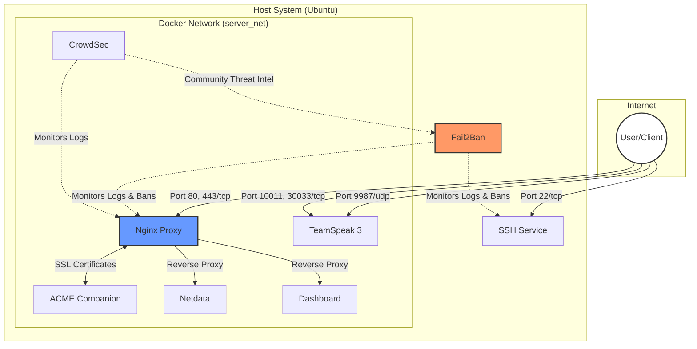

# Server Setup Documentation Repository

Welcome to the documentation repository for our server infrastructure. This repository contains all the necessary information to set up, configure, and maintain our server and its services.

## Repository Structure

- `docs/setup/`: System setup and service addition guides.
- `docs/services/`: Documentation for available services and their configurations.
- `docker-compose.yml`: Main configuration to bring up all dockerized services.
- `tools.py`: Tooling and helper scripts for automation.

## Getting Started

To get started with the server setup, follow these guides in order:
1. [First Steps](./docs/setup/01-first-steps.md) - Initial server hardening and base installation.
2. [Adding a New Service](./docs/setup/02-add-new-service.md) - How to extend this repository.

### Automated Setup

You can automate the entire base system setup (Firewall, SSH Hardening, Fail2Ban, Docker) using the included CLI:

```bash
# Perform full system setup
uv run tools.py setup-system

# Update only system packages
uv run tools.py system-update

# Deploy services
uv run tools.py docker deploy

# Create a backup
uv run tools.py backup-create

# Restore from a backup
uv run tools.py backup-restore backups/backup_YYYYMMDD_HHMMSS.tar.gz
```

## Tooling

This repository includes a Python CLI for server management and documentation maintenance.

### Available Commands

#### System Management
- `setup-system`: Perform full base system setup and hardening.
- `system-update`: Update system packages (apt update & upgrade).
- `housekeep`: Perform full system maintenance (Update, Backup, Check, Prune).

#### Docker Service Management
- `docker deploy`: Bring up all dockerized services.
- `docker stop`: Stop all dockerized services.
- `docker pull`: Pull latest images for all services.
- `docker rebuild`: Force rebuild and restart of all services.
- `docker status`: Show status of dockerized services.
- `docker logs [service]`: View service logs.
- `docker check-updates`: Check for available container updates (Monitor-only).

#### Backup & Restore
- `backup-create`: Create a full backup of services data and configuration.
- `backup-restore [archive]`: Restore data from a backup archive.

#### Documentation & Maintenance
- `list-services`: Visualize all configured services in the CLI.
- `lint`: Check markdown files for formatting issues.
- `fix-newlines`: Fix trailing newlines in markdown files.

### Usage Example

Run the tools via `uv`:

```bash
# Run the periodic housekeeping routine
uv run tools.py housekeep

# Check service status
uv run tools.py docker status

# Follow logs for a specific service
uv run tools.py docker logs netdata

# Force a rebuild of all containers
uv run tools.py docker rebuild
```

You can see all options using:

```bash
uv run tools.py --help
```

## Infrastructure Visualization

The following diagram illustrates how the services in this repository are structured and how they interact with each other and the public internet.



## Services Overview

The following services are configured and documented in this repository:

| Service | Description | Ports (Inbound) | Documentation |
| :--- | :--- | :--- | :--- |
| **Fail2Ban** | Intrusion prevention and SSH brute-force protection. | N/A | [View Guide](./docs/services/fail2ban/fail2ban.md) |
| **CrowdSec** | Collaborative threat intelligence and behavioral security. | N/A | [View Guide](./docs/services/crowdsec/crowdsec.md) |
| **Dashboard** | Modern landing page for all services (Proxied). | 80, 443 | [View Guide](./docs/services/dashboard/dashboard.md) |
| **Netdata** | Real-time infrastructure monitoring (Proxied). | 80, 443 | [View Guide](./docs/services/netdata/netdata.md) |
| **Nginx Proxy** | Automated Reverse Proxy with SSL (Let's Encrypt). | 80, 443 | [View Guide](./docs/services/nginx/nginx.md) |
| **TeamSpeak 3** | High-performance voice communication server. | 9987/udp, 10011/tcp, 30033/tcp | [View Guide](./docs/services/teamspeak3/teamspeak3.md) |

## Security and Maintenance

### Reverse Proxy
All web-facing services are behind an **Nginx Reverse Proxy** with automated SSL via **Let's Encrypt**. Direct access to service ports is restricted to the internal network where possible.

### Backups
Data persistence is handled via Docker volumes. Ensure you have a backup strategy for the `./teamspeak/data` and other critical directories. Recommended tool: `restic` or `borgbackup`.

### Update Workflow
To safely keep your system and services up to date:

1. **Check for container updates**:
   ```bash
   uv run tools.py docker check-updates
   ```
2. **Review the output**: Watchtower will tell you if a newer image exists for your pinned versions.
3. **If you decide to update**:
   - Update the version tag in `docker-compose.yml`.
   - Run the update commands:
     ```bash
     uv run tools.py system-update
     uv run tools.py docker pull
     uv run tools.py docker rebuild
     ```
