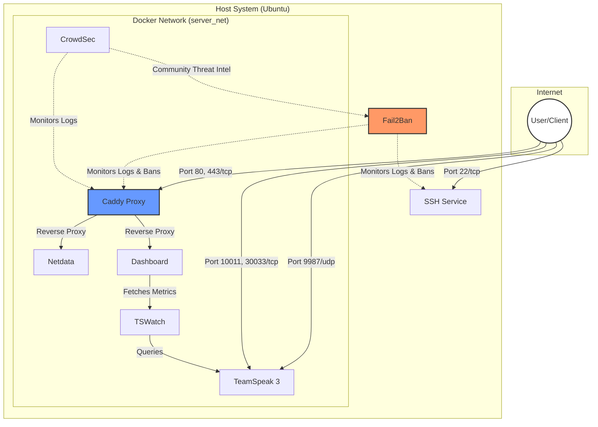

# Server Setup Documentation Repository

Welcome to the documentation repository for our server infrastructure. This repository contains all the necessary information to set up, configure, and maintain our server and its services.

## Repository Structure

- `docs/setup/`: System setup and service addition guides.
- `docs/services/`: Documentation for available services and their configurations.
- `management/`: Python classes for system and service management.
- `services/`: Configuration and volumes for all dockerized services and host tools (Caddy, Rclone, etc.).
- `docker-compose.yml`: Main configuration to bring up all dockerized services.
- `tools.py`: Tooling and helper scripts for automation.

## Getting Started

To get started with the server setup, follow these guides in order:
1. [First Steps](./docs/setup/01-first-steps.md) - Initial server hardening and base installation.
2. [Adding a New Service](./docs/setup/02-add-new-service.md) - How to extend this repository.
3. [Basic Authentication](./docs/setup/03-security-auth.md) - Secure your dashboard and monitoring.

### Automated Setup

You can automate the entire base system setup (Firewall, SSH Hardening, Fail2Ban, Docker) using the included CLI:

```bash
# Perform full system setup
uv run tools.py setup-system

# Update only system packages
uv run tools.py system-update

# Deploy services
uv run tools.py docker deploy

# Create a backup
uv run tools.py backup-create

# Restore from a backup
uv run tools.py backup-restore backups/backup_YYYYMMDD_HHMMSS.tar.gz
```

## Tooling

This repository includes a Python CLI for server management and documentation maintenance.

### Available Commands

#### System Management

- `setup-system`: Perform full base system setup and hardening.
- `system-update`: Update system packages (apt update & upgrade).
- `setup-env`: Initialize `.env` file from `.env.example`.
- `housekeep`: Perform full system maintenance (Update, Backup, Check, Prune).

#### Docker Service Management

- `docker deploy`: Bring up all dockerized services.
- `docker stop`: Stop all dockerized services.
- `docker pull`: Pull latest images for all services.
- `docker rebuild`: Force rebuild and restart of all services.
- `docker status`: Show status of dockerized services.
- `docker logs [service]`: View service logs.
- `docker check-updates`: Check for available container updates (Monitor-only).
- `docker test`: Validate docker-compose configuration (dry-run).

#### Authentication Management

- `auth add-user [username] --vhost [domain]`: Add or update a user for a specific virtual host.
- `auth remove-user [username] --vhost [domain]`: Remove a user from a specific virtual host.

#### Backup & Restore

- `backup-create`: Create a full backup of services data and configuration.
- `backup-restore [archive]`: Restore data from a backup archive.
- `backup-upload`: Upload local backups to cloud storage (Rclone).
- `backup-download`: Download backups from cloud storage.
- `setup-backup-cron`: Configure daily automated backups and cloud upload.

#### Documentation & Maintenance

- `list-services`: Visualize all configured services in the CLI.
- `lint`: Check markdown files for formatting issues.
- `fix-newlines`: Fix trailing newlines in markdown files.

### Usage Example

Run the tools via `uv`:

```bash
# Run the periodic housekeeping routine
uv run tools.py housekeep

# Check service status
uv run tools.py docker status

# Follow logs for a specific service
uv run tools.py docker logs netdata

# Force a rebuild of all containers
uv run tools.py docker rebuild
```

You can see all options using:

```bash
uv run tools.py --help
```

## Infrastructure Visualization

The following diagram illustrates how the services in this repository are structured and how they interact with each other and the public internet.



## Services Overview

The following services are configured and documented in this repository:

| Service | Description | Ports (Inbound) | Documentation |
| :--- | :--- | :--- | :--- |
| **Fail2Ban** | Intrusion prevention and SSH brute-force protection. | N/A | [View Guide](./docs/services/fail2ban/fail2ban.md) |
| **CrowdSec** | Collaborative threat intelligence and behavioral security. | N/A | [View Guide](./docs/services/crowdsec/crowdsec.md) |
| **Dashboard** | Modern landing page for all services (Proxied). | 80, 443 | [View Guide](./docs/services/dashboard/dashboard.md) |
| **Netdata** | Real-time infrastructure monitoring (Proxied). | 80, 443 | [View Guide](./docs/services/netdata/netdata.md) |
| **Caddy** | Automated Reverse Proxy with built-in SSL (Let's Encrypt). | 80, 443 | [View Guide](./docs/services/caddy/caddy.md) |
| **TeamSpeak 3** | High-performance voice communication server. | 9987/udp, 10011/tcp, 30033/tcp | [View Guide](./docs/services/teamspeak3/teamspeak3.md) |
| **TSWatch** | Metrics helper for TeamSpeak 3 Dashboard integration. | N/A | [View Guide](./docs/services/tswatch/tswatch.md) |
| **Rclone** | Cloud backup synchronization and encryption. | N/A | [View Guide](./docs/services/rclone/rclone.md) |

## Security and Maintenance

### Reverse Proxy

All web-facing services are behind a **Caddy Reverse Proxy** with automated SSL via **Let's Encrypt**. Direct access to service ports is restricted to the internal network where possible.

### Backups Workflow

Data persistence is handled via Docker volumes and configuration files. To ensure your data is safe, use the built-in backup tools:

1. **Create a Backup**:

   ```bash
   uv run tools.py backup-create
   ```

   This creates a timestamped archive in the `backups/` directory containing service data and configurations.

2. **Restore from a Backup**:

   ```bash
   uv run tools.py backup-restore backups/backup_YYYYMMDD_HHMMSS.tar.gz
   ```

   *Note: Restoring will overwrite current data. The tool handles stopping and restarting services as needed.*

3. **Cloud Synchronization (Optional)**:

   To protect against local data loss, you can sync your backups to cloud storage (e.g., Google Drive) using Rclone:

   ```bash
   # Upload existing backups
   uv run tools.py backup-upload
   ```

   ```bash
   # Automated daily backup & upload (Recommended)
   uv run tools.py setup-backup-cron
   ```

   See the [Rclone Guide](./docs/services/rclone/rclone.md) for setup and encryption details. Backups on the cloud are automatically rotated after **14 days**.

### Update Workflow

To safely keep your system and services up to date, you can use the automated housekeeping tool or follow the manual steps.

#### Automated Maintenance (Recommended)

Run the housekeeping routine to update the system, create a safety backup, check for container updates, and clean up Docker resources:

```bash
uv run tools.py housekeep
```

#### Manual Update Steps

1. **Check for container updates**:

   ```bash
   uv run tools.py docker check-updates
   ```

2. **Review the output**: Watchtower will identify if newer images are available for your running containers.

3. **Apply updates**:

   - Update version tags in `docker-compose.yml` if you are pinning specific versions.
   - Execute the update sequence:

     ```bash
     uv run tools.py system-update
     uv run tools.py docker pull
     uv run tools.py docker rebuild
     ```
